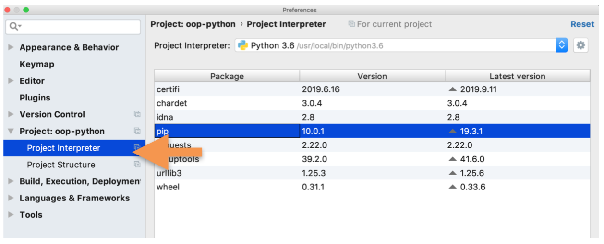
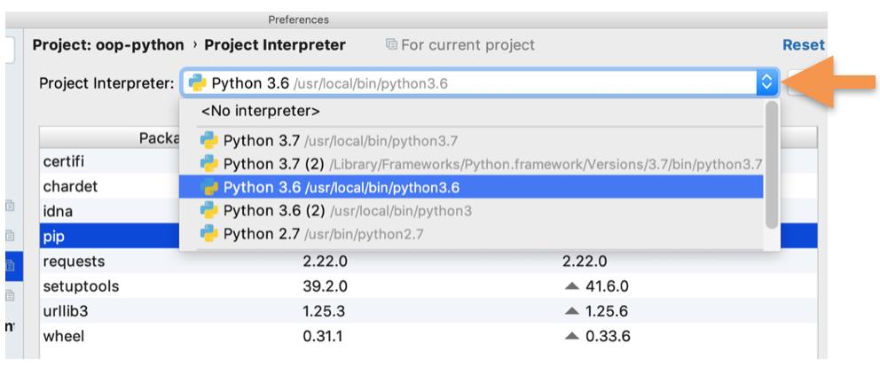
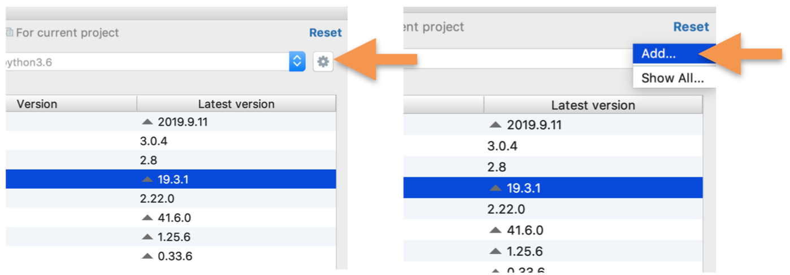
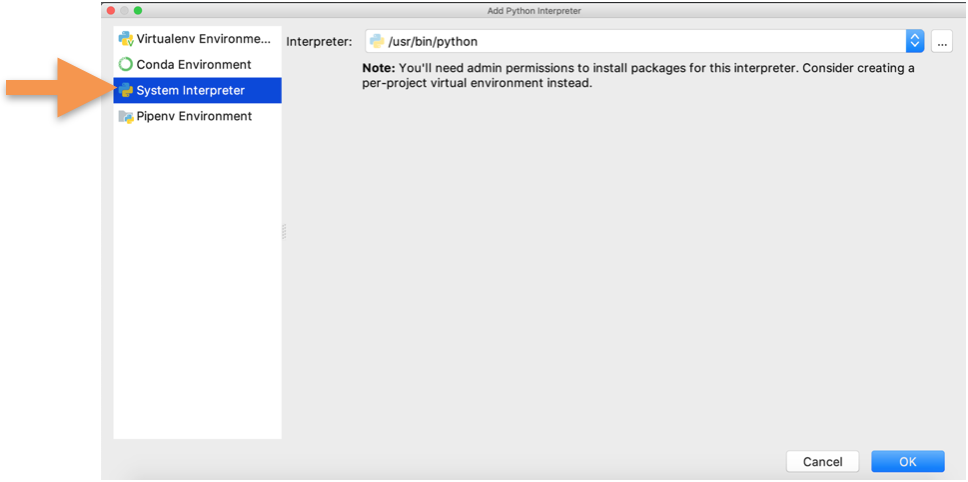
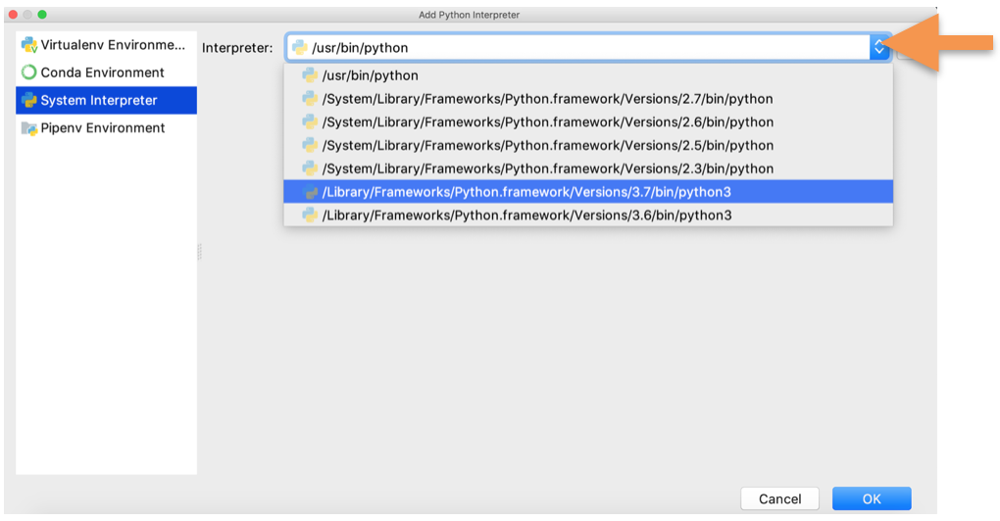
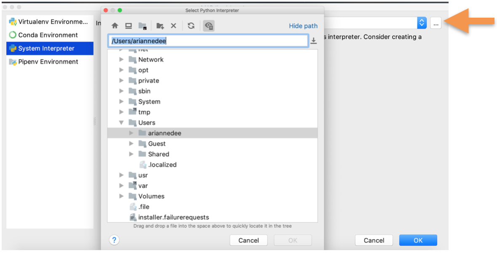

# Configuring your Python virtual environment PyCharm (Community and Pro)

## 1. Open your settings/preferences

   
   
## 2. Navigate to the Project Interpreter

   
   
## 3a. Select an existing interpreter

   
   
   If your desired version was found, click OK. If not, go on to 3b.

## 3b. Add a new interpreter

   

## 4. Add a system interpreter
   
   
## 5a. Select an existing system interpreter

   
   
   If your desired version was found, click OK. If not, go on to 5b.

## 5b. Find your system interpreter

   

If you’re not sure where to find it, try one of the following locations
(replace 3.9 or 39 with the desired version number):

### Windows (look for python.exe)
- C:\Python39
- C:\Program Files\Python39
- C:\Users\username\AppData\Local\Programs\Python\Python39-XX

### Mac (look for python3.9 or python3)
- /usr/local/bin/
- /Library/Frameworks/Python.framework/Versions/3.9/bin/
- /usr/local/Cellar/python/3.9.X_X/bin/
- /Users/username/anaconda/bin/
- /anaconda3/bin/

### Linux (look for python3.9 or python3)
- /usr/bin/
- /usr/local/bin