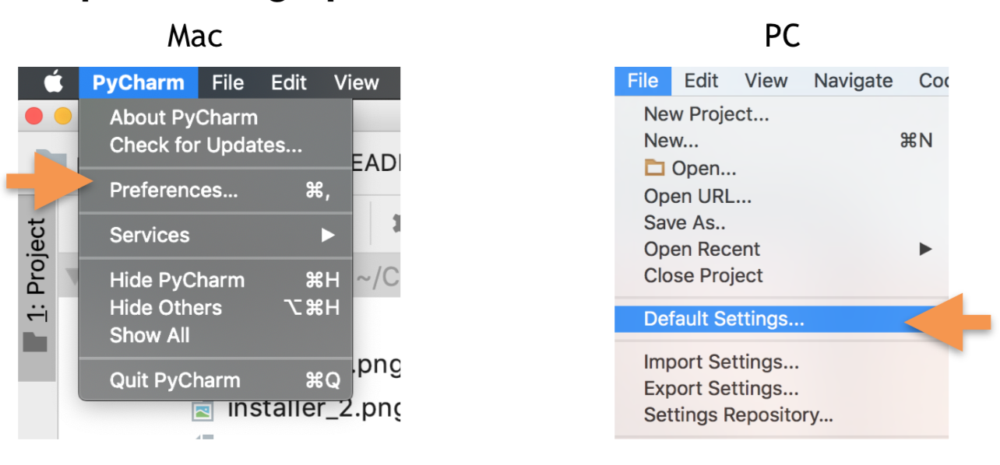
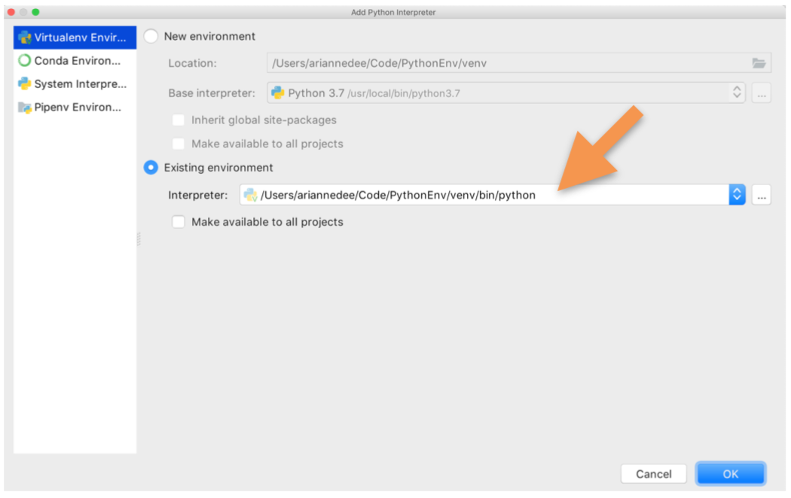

# Configuring your Python virtual environment PyCharm (Community and Pro)

## 1. Open your settings/preferences

   
   
## 2. Navigate to the Project Interpreter

   
   
## 3. Add a new interpreter

   

## 4. Select your existing virtual environment

   

## 5. Or create a new virtual environment

   
